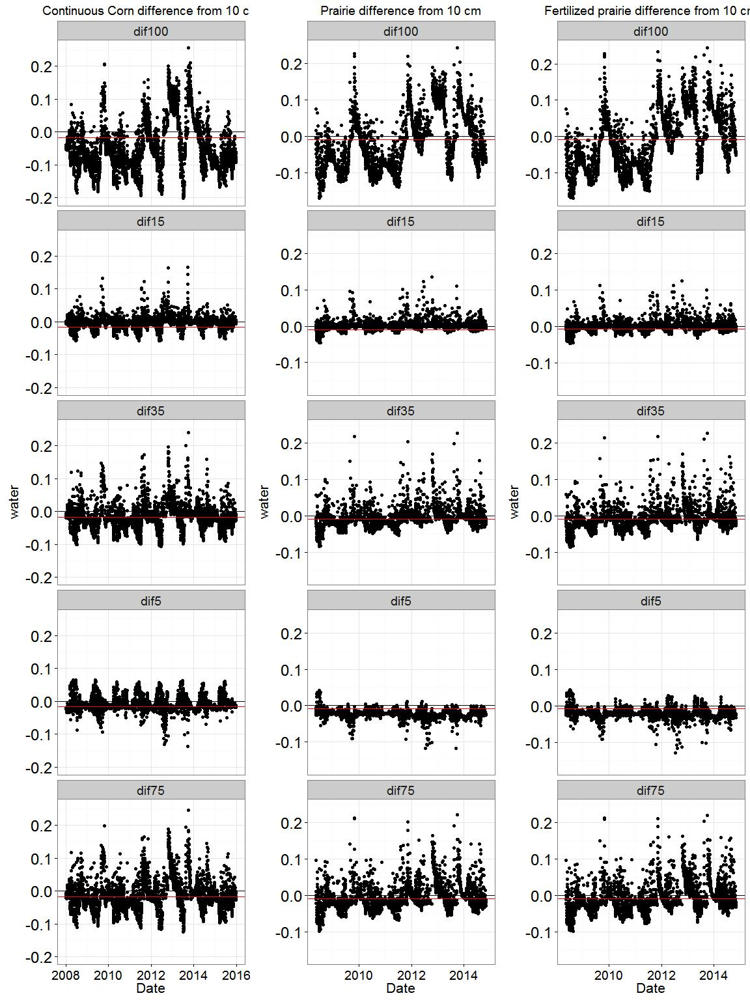

The effect of depth on decomposition
================

#### My public notebook -- details contained in folders above

### Why should we do this?

Half of the world's organic carbon (C) is located below 20 cm, but the mechanisms behind the creation and retention of this organic C are unclear, especially considering that most organic C sources are concentrated above 20 cm or aboveground.

As we move deeper into the soil and further from the soil surface, temperature, moisture, O2 availability, texture, pH, and even root tissue composition change. These environmental properties and their interactions with each other can be described as one factor: *depth*. There are large differences in the amount of organic matter with location in the soil profile due to both the amount of plant litter input and the effect of depth on decomposition rates and organic matter stabilization. Inputs can be easily measured and compared, but decomposition and the fate of its products are more difficult to study, especially below the soil surface.

Depth is an emergent property that cannot be recreated in a laboratory, yet much of what we know about decomposition at depth is dependent upon laboratory studies with carefully controlled conditions. The rest of what we know about the effect of depth comes from in-field studies that used litter bags to measure decomposition. Litter bags introduce major problems relevant to decomposition, mainly that they restrict contact between soil and organic matter, greatly reducing the ability of microorganisms to reach and catabolize organic matter.

This experiment seeks to examine the effect of depth on decomposition without physically controlling the components that make up depth and without creating an artificial environment such as that found inside litter bags. This examination will include analysis focused on the components that contribute to the depth effect.

Question:

-   How does depth affect rate of decomposition? Is this consistent with current decomposition models?

### Protocol

One subplot will be established in each continuous corn, fertilized prairie, and prairie plot. Subplots will be approximately 6 feet from the south and west borders. Subplots will be 5' x 5'.

In the prairie treatments, each subplot will be created by first cutting down the existing vegetation using a weedeater and/or pruning shears. Vegetation will be allowed to grow back to ~ 8" then sprayed with glyphosate, then sprayed with glyphosate again after a couple days. Two soil cores will be taken to a 1 m depth in each subplot. The Giddings will also be used to install ECH2O temp and moisture sensors at 7.5, 30, 60, and as long as my arm cm depths. Subplots will then be covered with landscaping cloth, secured by edging that will go as deep as we can get it. Corn plots will be similar and span three rows, with the sampling focused on the middle row.

Two cores will be taken at time 0, a few days after the last application of RoundUp. Cores will be split into 5 depth increments by centimeters -- 0-20, 20-40, 40-60, 60-80, 80-100 and bagged in the field. Bags will be weighed for bulk density and root-free soil will be removed from the samples for analysis of moisture content (bulk density), organic C, total N, and POM. The remainder of the sample will be elutriated and processed for root biomass. Root will also be processed for C, N, and possibly some other components.

### Experimental design

#### S is sensors, 4 cores in 2016, 2 in 2017, 2 in 2018

#### S is sensors, green is corn rows 4 cores in 2016, 2 in 2017, 2 in 2018

#### Placement within plots

Step 1. First cutting 2016-07-27

    

### Convincing image for why litter bags are bad

### What we know about soil temperature and moisture from previous years

#### COBS differences between treatments

One treatment minus (-) the other
Red line is mean difference

##### Water

##### Temperature

#### COBS differences between depths

Value at 10 cm minus each depth
Red line is mean difference

##### Water

##### Temperature

