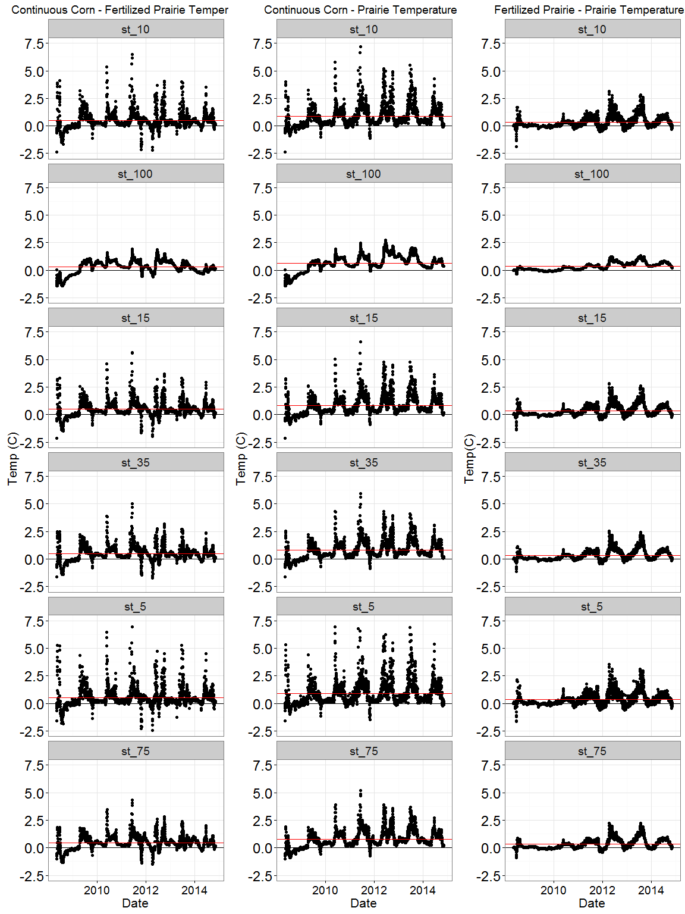

The effect of depth on decomposition
================

### Why should we do this?

Half of the world's organic carbon (C) is located below 20 cm, but the mechanisms behind the creation and retention of this organic C are unclear, especially considering that most organic C sources are concentrated above 20 cm or aboveground.

As we move deeper into the soil and further from the soil surface, temperature, moisture, O2 availability, texture, pH, and even root tissue composition change. These environmental properties and their interactions with each other can be described as one factor: *depth*. There are large differences in the amount of organic matter with location in the soil profile due to both the amount of plant litter input and the effect of depth on decomposition rates and organic matter stabilization. Inputs can be easily measured and compared, but decomposition and the fate of its products are more difficult to study, especially below the soil surface.

Depth is an emergent property that cannot be recreated in a laboratory, yet much of what we know about decomposition at depth is dependent upon laboratory studies with carefully controlled conditions. The rest of what we know about the effect of depth comes from in-field studies that used litter bags to measure decomposition. Litter bags introduce major problems relevant to decomposition, mainly that they restrict contact between soil and organic matter, greatly reducing the ability of microorganisms to reach and catabolize organic matter.

This experiment seeks to examine the effect of depth on decomposition without physically controlling the components that make up depth and without creating an artificial environment such as that found inside litter bags. This examination will include analysis focused on the components that contribute to the depth effect.

Some questions:

-   How does depth affect rate of decomposition? Is this consistent with current decomposition models?
-   How does *residue quality* affect the proportions of organic matter lost as DOC, CO2, and fine-fraction POM?
-   How does depth affect the proportion of organic matter lost as DOC and fine-fraction POM?

### Protocol

One subplot will be established in each continuous corn, fertilized prairie, and prairie plot. Subplots will be approximately 6 feet from the south and west borders. Subplots will be 5' x 5'. Each subplot will be created by first cutting down the existing vegetation using a weedeater and/or pruning shears. Vegetation will be allowed to grow back to ~ 8" then sprayed with glyphosate, then sprayed with glyphosate again. Two soil cores will be taken to a 1 m depth in each subplot. One of the holes created by the core will be used to install ECH2O temp and moisture sensors at 7.5, 30, 60, and as long as my arm depths. Subplots will then be covered with brown landscaping cloth, secured by edging that will go as deep as we can get it.

### Plot design

### Convincing image for why litter bags are bad

### What we know about soil temperature and moisture

#### COBS differences between treatments

One treatment minus (-) the other
Red line is mean difference

##### Water

##### Temperature

#### COBS differences between depths

Value at 10 cm minus each depth
Red line is mean difference

##### Water

##### Temperature

