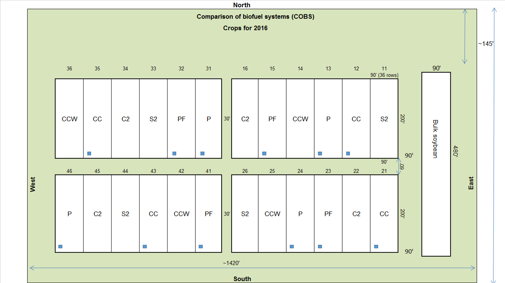
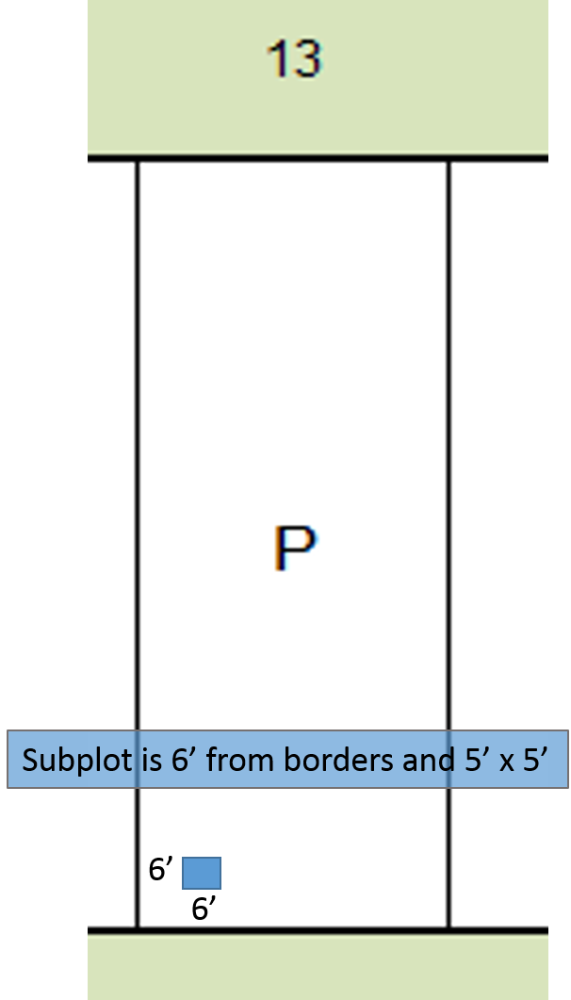
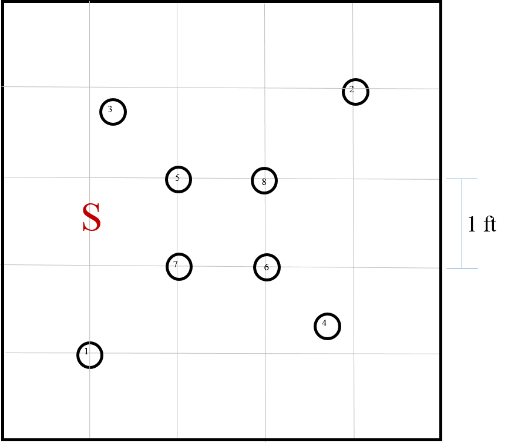

```{r setup, include=FALSE}
knitr::opts_chunk$set(
	echo = FALSE,
	message = FALSE,
	warning = FALSE
)
library(tidyverse)
library(lubridate)
library(plotrix)

this_theme<-theme_bw()+
  theme(#panel.grid.major = element_blank(),
    #panel.grid.minor = element_blank(),
    panel.background = element_blank(),
    axis.line = element_line(),
    legend.position='none', legend.title=element_blank(),
    legend.text = element_text(size=12),
    axis.title.x = element_text(size=22,vjust=-0.5),
    axis.title.y = element_text(size=22,angle=90, vjust=1.2),
    axis.text.x = element_text(colour="black", size=18),
    axis.text.y = element_text(colour="black", size=18), 
    strip.text = element_text(colour="black", size=18))

theme_set(this_theme)
```  

##Objective of the project    


Examine the effect of depth on decomposition without physically controlling the components that make up depth and without creating an artificial environment such as that found inside litter bags.  

Use three different C:N ratios - corn roots, fertilized prairie roots, unfertilized prairie roots. 

## Locations and timing  

  

##  

<center></center>

##  

<center></center>


  
## 7/27/2016 { .cover .white }

  

##Before & After  

<center></center>
<center></center>


##Data collected and to be collected  

-Root pool mass and C/N content    
-Soil C, N, and POM    
-Subplot soil moisture and temperature (to 70 cm)  

<center></center>
  

##Brief summary of the recent results  

```{r, include=FALSE}
datain<-read_csv("../Data/2017-2-2COBS Root Sample Lab Data.csv")

roots<-datain%>%
     mutate(trt = ifelse((plot %in% c("12", "35", "21", "43")), "corn",
                        ifelse((plot %in% c("13", "31", "24", "46")), "prairie",
                               ifelse((plot %in% c("15", "32", "23", "41")), "fertilized_prairie", "nada"))))%>%
  mutate(Root_g_m2 = (`root weight (g)`/.00203))%>%
  group_by(trt, depth)%>%
  summarise_each(funs(mean(., na.rm = TRUE), std.error(., na.rm = TRUE)))
```

```{r, fig.width = 4, fig.height=4.5}

roots <- within(roots, trt <- ordered(trt, levels = c("corn", "fertilized_prairie", "prairie")))
roots <- within(roots, depth <- ordered(depth, levels = rev(sort(unique(depth)))))

desert<-c("#24019B", "#E06100", "#83304C")
dodge=position_dodge(width=0.9)
ggplot(roots, aes(x=depth, y = Root_g_m2_mean, fill=trt)) + 
    geom_bar(stat = "identity", position = dodge) +
    geom_errorbar(aes(ymax = Root_g_m2_mean + Root_g_m2_std.error, ymin=Root_g_m2_mean - Root_g_m2_std.error), position = dodge, width=0.2) +
    #scale_x_reverse()+
    coord_flip()+
    scale_fill_manual(values = desert, breaks=c("corn", "fertilized_prairie", "prairie"), labels=c("Corn", "Fertilized Prairie", "Prairie"))+
    guides(col = guide_legend(reverse = FALSE))+
    labs(y = (expression(paste("Root (g m" ^ "-2",")"))),x = "Depth (cm)")+
    theme(#panel.grid.major = element_blank(),
          #panel.grid.minor = element_blank(),
          panel.background = element_blank(),
          axis.line = element_line(),
          legend.position=c(.65,.35), legend.title=element_blank(), 
          legend.key.size=unit(.55, "cm"), legend.text = element_text(size=13),
          axis.title.x = element_text(size=16),
          axis.title.y = element_text(size=16,angle=90),
          axis.text.x = element_text(colour="black", size=16),
          axis.text.y = element_text(colour="black", size=16))
```
```{r, , fig.width = 3.5, fig.height=4.5, warning=FALSE}
desert<-c("#24019B", "#E06100", "#83304C")
dodge=position_dodge(width=0.9)
datain%>%
     mutate(trt = ifelse((plot %in% c("12", "35", "21", "43")), "corn",
                        ifelse((plot %in% c("13", "31", "24", "46")), "prairie",
                               ifelse((plot %in% c("15", "32", "23", "41")), "fertilized_prairie", "nada"))))%>%
  mutate(Root_g_m2 = (`root weight (g)`/.00203))%>%
  group_by(trt, plot,rep)%>%
  summarise(whole= sum(Root_g_m2))%>%
  group_by(trt)%>%
  summarise_each(funs(mean(., na.rm = TRUE), std.error(., na.rm = TRUE)))%>%
  ggplot(aes(x=trt, y=whole_mean, fill=trt))+
  geom_bar(stat = "identity")+
  geom_errorbar(aes(ymax = whole_mean + whole_std.error, ymin=whole_mean - whole_std.error), position = dodge, width=0.2) +
  scale_fill_manual(values = desert)+#, breaks=c("corn", "fertilized_prairie", "prairie"), labels=c("corn", "Fertilized Prairie", "Prairie"))+
    scale_y_continuous(position = "right")+
    guides(col = guide_legend(reverse = FALSE))+
    labs(y = (expression(paste("Root (g m" ^ "-2","), 1 m depth"))),x = "")+
    theme(#panel.grid.major = element_blank(),
          #panel.grid.minor = element_blank(),
          panel.background = element_blank(),
          axis.line = element_line(),
          legend.position="none", legend.title=element_blank(), 
          legend.key.size=unit(.65, "cm"), legend.text = element_text(size=16),
          axis.title.x = element_blank(),
          axis.title.y = element_text(size=16,angle=90), 
          axis.text.x = element_blank(),
          axis.text.y = element_text(colour="black", size=16))
```  

##Plans for 2017    
- Install shallow partitions (6 inch depth) around each subplot.  
- Cover the subplots with landscaping fabric to limit how often I need to go spray glyphosate.  
- Take 2 more sets of 1 m soil cores in 2017. The first will be in June, the second in November.  
- Maintain soil sensors in all subplots.  
- Fill holes with bentonite.  

##Needs for assistance  
- I need to use the elutriator in late June and November if possible.    
<center></center>  


- We need to communicate about dataloggers during field operations.  

##Potential for collaboration  
- Open to anything.  
- Have a good amount of air-dried soil from the first cores.  
- You can find everything I generate from this project (data, code, text) on [GitHub](https://github.com/Ranae/LCSASoilCinIowa/tree/master/Depth%20and%20decomposition).
